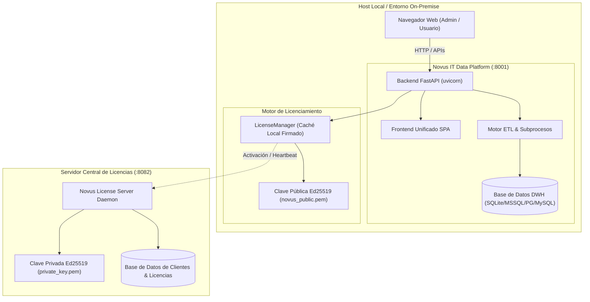

# Novus IT · Data Platform & Motor ETL
## Manual de Arquitectura, Operación, Seguridad y Licenciamiento

Documento maestro de referencia técnica, funcional y operativa de la plataforma **Novus IT · Data Platform**.

---

## 1. Visión General y Propósito del Producto

**Novus IT · Data Platform** es una solución corporativa integral diseñada para la extracción, transformación y carga (ETL) multi-fuente, modelado analítico derivado (DWH), generación de entregables de Business Intelligence (Power BI) y visualización ejecutiva en tiempo real.

### Pilares Fundamentales:
1. **Neutralidad de Marca y Protección de IP**: Código desacoplado de datos de clientes específicos, parametrizado al 100% mediante archivos declarativos (`config.json`).
2. **Arquitectura Criptográfica Offline-First**: Sistema de licenciamiento asimétrico Ed25519 con tolerancia a desconexión y control modular granular.
3. **Diseño Visual Corporativo Enterprise**: Interfaz moderna inspirada en los estándares visuales de [novusit.cl](https://novusit.cl), tipografía *Plus Jakarta Sans*, paleta cromática *Deep Navy* (`#0C2A49`) y *Vibrant Orange* (`#EA7222`).
4. **Resiliencia Operativa**: Bloqueo de concurrencia dual (lock en filesystem + lock en base de datos), auto-recuperación de procesos huérfanos y migraciones DDL idempotentes por dialecto.

---

## 2. Topología de Servicios y Puertos



| Servicio / Componente | Puerto | Protocolo | Descripción |
|---|---|---|---|
| **Frontend & Backend Unificado** | `8001` | HTTP | Interfaz web principal, APIs de autenticación, monitoreo ETL, gestión de usuarios, vistas analíticas y exportación BI. |
| **Novus License Server Daemon** | `8082` | HTTP | Servidor emisor y verificador de licencias criptográficas para el sandbox y validaciones remotas. |
| **Producción (Instalación Nativa)** | `8000` | HTTP | Puerto estándar asignado para despliegues en servidores productivos systemd. |

---

## 3. Módulos de la Plataforma

### 3.1. Portal de Acceso Corporativo (`/login`)
- Autenticación segura mediante cookies `HttpOnly`, tokens JWT (HS256) y hashing bcrypt (costo 12).
- Branding oficial Novus IT (`/static/novus-logo.png`).
- Control de cambio de contraseña forzado en primer inicio de sesión y limitación de intentos de acceso (rate limiting).

### 3.2. Consola de Monitoreo ETL & Onboarding SAP RFC (`/etl`)
- **Telemetría en Vivo**: Indicador de fases de extracción, porcentaje de avance por chunks y filas procesadas en tiempo real.
- **Historial de Ejecuciones**: Tabla interactiva de corridas con tiempos de ejecución, volumen de datos y estados.
- **Configuración Asistida SAP NetWeaver RFC**:
  - Modal interactivo para parámetros de conexión (`ashost`, `sysnr`, `client`, `user`, `passwd`, `lang`).
  - Diagnóstico de conexión en tiempo real con medición de latencia en milisegundos.
  - Validación de campos obligatorios con retroalimentación visual inmediata.
- **Sincronización Bajo Demanda**: Disparo controlado con bloqueo de concurrencia y protección contra ejecuciones simultáneas.

### 3.3. Panel de Administración y Gestión de Usuarios (`/panel`)
- Gestión centralizada de usuarios (creación, edición de roles `admin`/`user`, activación/desactivación).
- Modal corporativo para restablecimiento seguro de claves con validación de longitud mínima (8 caracteres).
- Monitoreo global de registros y deltas de sincronización.

### 3.4. Vistas Analíticas & Exportación BI (`/derivadas`)
- KPIs ejecutivos: Total de Materiales, Unidades en Stock, Valorización Monetaria Consolidada y Alertas de Stock Bajo Mínimo.
- Filtros dinámicos multidimensionales por Centro, Almacén y Área de Negocio.
- Búsqueda en vivo y visualización paginada con filas críticas resaltadas.
- **Descargas Directas al Navegador**:
  - Exportación de Manifiesto y Datos en formato **CSV**.
  - Descarga de Reportes Consolidados y Listados de Alertas en **Excel** (`.xlsx`).

### 3.5. Sistema de Licenciamiento Criptográfico (`/license`)
- Control de acceso por módulos contratados (`dashboard`, `derived`, `bi`).
- Pantalla dedicada de bloqueo ante suspensiones, expiraciones o revocaciones sin alertas redundantes.
- Soporte de período de gracia (*Grace Period*) y tolerancia a desconexión (*Offline Tolerance*).

---

## 4. Comandos Operativos y Scripts Rápidos

### 4.1. Gestión de Servidores y Demo
```bash
# Iniciar / Detener / Reiniciar la plataforma completa en modo demo (:8001)
./scripts/run_demo.sh start
./scripts/run_demo.sh restart
./scripts/run_demo.sh stop
./scripts/run_demo.sh status

# Iniciar / Detener el servidor de licencias sandbox (:8082)
./scripts/run_license_sandbox.sh start
./scripts/run_license_sandbox.sh restart
./scripts/run_license_sandbox.sh stop
```

### 4.2. Simulación de Escenarios de Licenciamiento
```bash
# Simular diferentes estados de negocio en vivo:
./scripts/run_license_sandbox.sh scenario E01    # Licencia Activa Completa
./scripts/run_license_sandbox.sh scenario E02    # Modular: Solo Dashboard
./scripts/run_license_sandbox.sh scenario E05    # Período de Gracia (Grace Period)
./scripts/run_license_sandbox.sh scenario E06    # Licencia Vencida (Expired)
./scripts/run_license_sandbox.sh scenario E07    # Servicio Suspendido por Novus
./scripts/run_license_sandbox.sh scenario E08    # Licencia Revocada
```

### 4.3. Motor ETL y CLI
```bash
# Ejecutar pipeline ETL completo
python -m cli run

# Validar entorno y conectividad (Smoke Test)
python -m cli bootstrap

# Aplicar migraciones DDL idempotentes
python -m cli migrate

# Generar artefactos de Business Intelligence
python -m cli bi manifest
python -m cli bi export
python -m cli bi guide
```

---

## 5. Pruebas y Validación de Calidad

La suite automatizada cuenta con **327 pruebas unitarias, de integración y E2E**:

```bash
# Ejecución de todas las pruebas
.venv/bin/pytest
```

**Resultado verificado**: `327 passed, 19 skipped, 1 warning (100% de éxito)`.

---

© 2026 Novus IT Solutions · Todos los derechos reservados.
