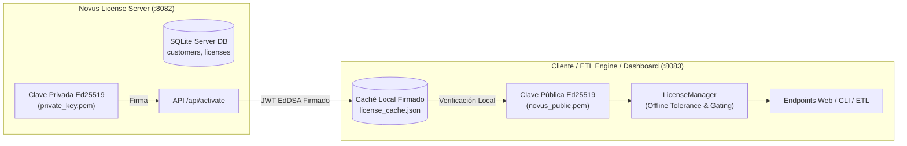

# Entorno de Pruebas y Simulación de Licenciamiento (Novus BI)

Guía completa para desarrollo, control de calidad (QA) y soporte operativo del sistema de licenciamiento del motor ETL y Dashboard.

---

## 1. Arquitectura y Fundamentos

El sistema de licenciamiento opera bajo un esquema **offline-first con criptografía asimétrica Ed25519**:



### Principios de Diseño:
1. **Verificación Criptográfica Local**: El cliente nunca envía su clave privada ni depende de estar 100% conectado al servidor para operar minuto a minuto.
2. **Tolerancia a Fallos y Período de Gracia (`offline_until`)**: Si el servidor de licencias no responde por corte de red o mantenimiento, el motor y dashboard continúan funcionando utilizando el caché firmado hasta que venza el período de gracia.
3. **Control Modular de Funcionalidades**:
   - `derived`: Materialización de visiones derivadas e inventario consolidado.
   - `dashboard`: Acceso a la interfaz web y APIs del dashboard.
   - `bi`: Generación de manifiestos, exportación CSV/Parquet y guías para Power BI.
4. **Límite de Usuarios (`limits.users`)**: Controla la cantidad máxima de usuarios que se pueden registrar en el sistema.
5. **Doble Aislamiento en Pruebas**: El entorno sandbox y los simuladores utilizan bases de datos en memoria/archivos temporales y puertos dedicados (`:8082`, `:8083`), garantizando cero colisiones con producción (`:8000`) o instancias de demo (`:8001`).

---

## 2. Matriz de los 12 Escenarios de Simulación

| ID | Escenario | Estado | Módulos (`derived`, `dashboard`, `bi`) | Límite Users | Comportamiento Esperado |
|:---|:---|:---:|:---:|:---:|:---|
| **E01** | **Licencia Completa Activa** | `ACTIVE` | ✅ / ✅ / ✅ | 10 | Todas las funciones activas. Sincronización permitida. |
| **E02** | **Modular: Solo Dashboard** | `ACTIVE` | ❌ / ✅ / ❌ | 5 | Dashboard e inventario base activos. CLI `reporte` y `bi` bloqueados con `403`. |
| **E03** | **Modular: Sin Dashboard** | `ACTIVE` | ✅ / ❌ / ✅ | 5 | Dashboard web bloquea rutas y muestra `license.html`. CLI `reporte` y `bi` operativos. |
| **E04** | **Límite de Usuarios Alcanzado** | `ACTIVE` | ✅ / ✅ / ✅ | 2 | Crear un 3er usuario en Panel o CLI falla con `HTTP 403 límite_usuarios`. |
| **E05** | **Período de Gracia (Grace Period)** | `GRACE` | ✅ / ✅ / ✅ | 5 | Banner de advertencia en UI y logs: *"Licencia en período de gracia"*. Sistema operativo. |
| **E06** | **Licencia Vencida (Expired)** | `EXPIRED` | ❌ / ❌ / ❌ | 5 | Acceso bloqueado a vistas protegidas (`license.html`). CLI bloquea ejecución. |
| **E07** | **Licencia Suspendida** | `SUSPENDED` | ❌ / ❌ / ❌ | 5 | Estado bloqueante por mora o decisión administrativa en servidor. |
| **E08** | **Licencia Revocada** | `REVOKED` | ❌ / ❌ / ❌ | 5 | Anulación total inmediata de la licencia. |
| **E09** | **Servidor Offline con Caché Válido** | `ACTIVE` | ✅ / ✅ / ✅ | 10 | Corte de red transparente; cliente opera con normalidad desde caché. |
| **E10** | **Servidor Offline sin Caché** | `NO_CACHE` | ❌ / ❌ / ❌ | - | Retorna `LicenseUnreachable`, previniendo arranques no autorizados. |
| **E11** | **Manipulación / Firma Adulterada** | `INVALID` | ❌ / ❌ / ❌ | - | Token modificado o clave falsa es rechazado al instante (`LicenseInvalid`). |
| **E12** | **Modo Sin Licencia (Open / Unmanaged)**| `NO_LICENSE` | ✅ / ✅ / ✅ | Ilimitado | Configuración libre sin bloque `"license"`. Todas las funciones habilitadas. |

---

## 3. Entorno Sandbox Aislado (`scripts/run_license_sandbox.sh`)

Permite levantar en menos de 2 segundos una infraestructura de prueba completa e independiente.

### Comandos de Operación:

```bash
# 1. Arrancar el sandbox completo
./scripts/run_license_sandbox.sh start

# 2. Verificar estado de los servicios y de la licencia
./scripts/run_license_sandbox.sh status

# 3. Aplicar y probar cualquier escenario en caliente
./scripts/run_license_sandbox.sh scenario E05    # Simular período de gracia
./scripts/run_license_sandbox.sh scenario E07    # Simular suspensión
./scripts/run_license_sandbox.sh scenario E01    # Restaurar licencia activa

# 4. Ver logs en tiempo real
./scripts/run_license_sandbox.sh log server
./scripts/run_license_sandbox.sh log dashboard

# 5. Detener el sandbox
./scripts/run_license_sandbox.sh stop

# 6. Limpieza total de archivos temporales
./scripts/run_license_sandbox.sh clean
```

### URLs y Accesos del Sandbox:
- **Dashboard Web**: `http://127.0.0.1:8083` (Usuario: `admin`, Clave: `admin`)
- **License Server**: `http://127.0.0.1:8082`
- **Configuración Sandbox**: `/tmp/etl_sandbox/config.sandbox.json`

---

## 4. Simulador CLI (`scripts/simulate_licensing.py`)

Herramienta para desarrolladores y scripts de integración continua:

### 1. Ejecución de la Matriz Completa:
```bash
# Salida en consola interactiva con colores
.venv/bin/python scripts/simulate_licensing.py run-all

# Salida en formato Markdown (para documentación o reportes automáticos)
.venv/bin/python scripts/simulate_licensing.py run-all --md

# Salida en formato JSON (para auditorías o CI/CD)
.venv/bin/python scripts/simulate_licensing.py run-all --json
```

### 2. Generación de Tokens a Medida:
```bash
.venv/bin/python scripts/simulate_licensing.py token \
  --customer empresa_001 \
  --license-id NOVUS-QA-999 \
  --status active \
  --valid-days 45 \
  --grace-days 10 \
  --modules derived,dashboard \
  --limits users=3
```

### 3. Inyección Rápida de Escenarios a un Archivo de Configuración:
```bash
.venv/bin/python scripts/simulate_licensing.py scenario E02 --config config.json
```

---

## 5. Inspección y Diagnóstico en Cliente (`etl license inspect`)

Comando integrado en el CLI principal para ver el diagnóstico exhaustivo de la licencia:

```bash
python -m cli license inspect --config config.json
```

### Salida de Ejemplo:
```text
=== Inspección Detallada de Licencia ===
Estado actual:       ACTIVE
Cliente ID:          empresa_001
Licencia ID:         NOVUS-001
Servidor configurado:https://licencias.novusit.cl
Ruta archivo caché:  /home/mist/.novus/license-empresa_001.json
Caché en disco:      PRESENTE (obtenido hace 120 s / 2 min)
Válida hasta:        2026-09-30 (44.5 días restantes)
Límite de gracia:    2026-10-07 (51.5 días)
Módulos habilitados: bi, dashboard, derived
Límite de usuarios:  2 / 5 en uso
```

---

## 6. Pruebas Automatizadas (Pytest)

Para validar todos los componentes y flujos E2E:

```bash
# Correr únicamente la suite de simulación E2E
.venv/bin/pytest tests/test_licensing_simulation_e2e.py -v

# Correr todas las pruebas relacionadas con licenciamiento
.venv/bin/pytest tests/test_licensing*.py tests/test_license_server*.py -v
```
